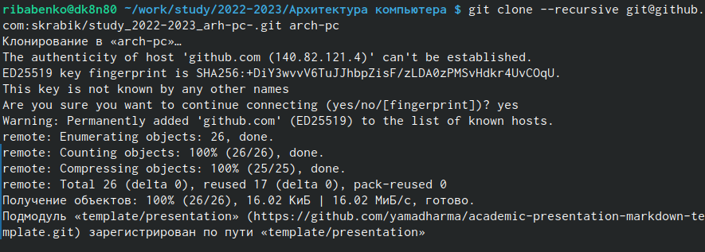

---
## Front matter
title: "Отчёт по лабораторной работе номер 3"
subtitle: "дициплина: Архитектура компьютеров"
author: "Бабенко Роман Игоревич"

## Generic otions
lang: ru-RU
toc-title: "Содержание"

## Bibliography
bibliography: bib/cite.bib
csl: pandoc/csl/gost-r-7-0-5-2008-numeric.csl

## Pdf output format
toc: true # Table of contents
toc-depth: 2
lof: true # List of figures
lot: true # List of tables
fontsize: 12pt
linestretch: 1.5
papersize: a4
documentclass: scrreprt
## I18n polyglossia
polyglossia-lang:
  name: russian
  options:
	- spelling=modern
	- babelshorthands=true
polyglossia-otherlangs:
  name: english
## I18n babel
babel-lang: russian
babel-otherlangs: english
## Fonts
mainfont: PT Serif
romanfont: PT Serif
sansfont: PT Sans
monofont: PT Mono
mainfontoptions: Ligatures=TeX
romanfontoptions: Ligatures=TeX
sansfontoptions: Ligatures=TeX,Scale=MatchLowercase
monofontoptions: Scale=MatchLowercase,Scale=0.9
## Biblatex
biblatex: true
biblio-style: "gost-numeric"
biblatexoptions:
  - parentracker=true
  - backend=biber
  - hyperref=auto
  - language=auto
  - autolang=other*
  - citestyle=gost-numeric
## Pandoc-crossref LaTeX customization
figureTitle: "Рис."
tableTitle: "Таблица"
listingTitle: "Листинг"
lofTitle: "Список иллюстраций"
lotTitle: "Список таблиц"
lolTitle: "Листинги"
## Misc options
indent: true
header-includes:
  - \usepackage{indentfirst}
  - \usepackage{float} # keep figures where there are in the text
  - \floatplacement{figure}{H} # keep figures where there are in the text
---

# Цель работы

Научиться работать с системой Git, изучить идеологию и применение средств контроля версий.

# Выполнение лабораторной работы

Создаю учетную запись на сайте https://github.com/ и заполняю основные данные (рис. [-@fig:2.1])

{ #fig:2.1 width=70% }

Сначала сделаем предварительную конфигурацию git. Для этого откроем терминал
и введем следующие команды, указав имя и email владельца репозитория.
Далее настроил utf-8 в выводе сообщений git. Следующим шагом задал имя
начальной ветки (будем называть её master):
Параметр autocrlf, и параметр safecrlf (рис. [-@fig:2.2])

{ #fig:2.2 width=70% }

Сгенерируем пару ключей (приватный и открытый) (рис. [-@fig:2.3.1])

{ #fig:2.3.1 width=70% }

Скопируем из локальной консоли ключ в буфер обмена (рис. [-@fig:2.3.2])

{ #fig:2.3.2 width=70% }

Вставляем ключ в появившееся на сайте поле и указываем для ключа имя (рис. [-@fig:2.3.3])

{ #fig:2.3.3 width=70% }

Откроем терминал и создадим каталог для предмета «Архитектура компьютера» (рис. [-@fig:2.3.4])

{ #fig:2.3.4 width=70% }

Перейдём на станицу репозитория с шаблоном курса https://github.com/yamadharma/course-directory-student-template. Выберем Use this template.у (рис. [-@fig:2.5.1])

{ #fig:2.5.1 width=70% }

Создаем репозиторий (рис. [-@fig:2.5.2])

{ #fig:2.5.2 width=70% }

Открываем терминал и переходим в каталог курса (рис. [-@fig:2.5.3])

{ #fig:2.5.3 width=70% }

Клонируем репозиторий (рис. [-@fig:2.5.4])

{ #fig:2.5.4 width=70% }

Переходим в каталог курса (рис. [-@fig:2.6.1])

{ #fig:2.6.1 width=70% }

Удалим лишние файлы (рис. [-@fig:2.6.2])

{ #fig:2.6.2 width=70% }

Отправим файлы на сервер (рис. [-@fig:2.6.3], рис. [-@fig:2.6.4])

{ #fig:2.6.3 width=70% }

{ #fig:2.6.4 width=70% }

Проверяем правильность создания рабочего пространства на github (рис. [-@fig:2.6.5])

{ #fig:2.6.5 width=70% }

# Задания для самостоятельной работы

1. Этот отчёт помещаем в соответствующий каталог рабочего пространства
(labs>lab03>report)
2. Также копируем отчеты по выполнению предыдущих лабораторных работ
соответствующие каталоги созданного рабочего пространства.
3. Загружаем файлы на github (рис. [-@fig:3.1], рис. [-@fig:3.2])

{ #fig:3.1 width=70% }

{ #fig:3.2 width=70% }

# Вывод

В ходе выполнения данной лабораторной работы, я научился работать с
системой Git, изучил идеологию и применение средств контроля версий.

