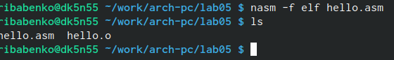

---
## Front matter
title: "Лабораторная работа номер 5"
subtitle: "Дисциплина: Архитектура компьютеров"
author: "Бабенко Роман Игоревич"

## Generic otions
lang: ru-RU
toc-title: "Содержание"

## Bibliography
bibliography: bib/cite.bib
csl: pandoc/csl/gost-r-7-0-5-2008-numeric.csl

## Pdf output format
toc: true # Table of contents
toc-depth: 2
lof: true # List of figures
lot: true # List of tables
fontsize: 12pt
linestretch: 1.5
papersize: a4
documentclass: scrreprt
## I18n polyglossia
polyglossia-lang:
  name: russian
  options:
	- spelling=modern
	- babelshorthands=true
polyglossia-otherlangs:
  name: english
## I18n babel
babel-lang: russian
babel-otherlangs: english
## Fonts
mainfont: PT Serif
romanfont: PT Serif
sansfont: PT Sans
monofont: PT Mono
mainfontoptions: Ligatures=TeX
romanfontoptions: Ligatures=TeX
sansfontoptions: Ligatures=TeX,Scale=MatchLowercase
monofontoptions: Scale=MatchLowercase,Scale=0.9
## Biblatex
biblatex: true
biblio-style: "gost-numeric"
biblatexoptions:
  - parentracker=true
  - backend=biber
  - hyperref=auto
  - language=auto
  - autolang=other*
  - citestyle=gost-numeric
## Pandoc-crossref LaTeX customization
figureTitle: "Рис."
tableTitle: "Таблица"
listingTitle: "Листинг"
lofTitle: "Список иллюстраций"
lotTitle: "Список таблиц"
lolTitle: "Листинги"
## Misc options
indent: true
header-includes:
  - \usepackage{indentfirst}
  - \usepackage{float} # keep figures where there are in the text
  - \floatplacement{figure}{H} # keep figures where there are in the text
---

# Цель работы

Научиться компилировать и собирать программы, написанные на ассемблере NASM.

# Выполнение лабораторной работы

Создаём каталог, переходим в него и создаём текстовый файл hello.asm. (рис. [-@fig:001])

{ #fig:001 width=70% }

Открываем его и вводим следующий текст. (рис. [-@fig:002])

{ #fig:002 width=70% }

Компилируем код и проверяем что создан файл hello.o. (рис. [-@fig:003])

{ #fig:003 width=70% }

Компилируем исходный файл в obj.o и проверяем его наличие. (рис. [-@fig:004])

{ #fig:004 width=70% }

Передаём объектный файл на обработку компановщику и  проверяем с помощью ls его наличие. (рис. [-@fig:005])

{ #fig:005 width=70% }

Выполняем следующую команду. Файл будет иметь имя 'main', он был создан из файла 'obj.o'. (рис. [-@fig:006])

{ #fig:006 width=70% }

Запускаем на выполнение исполняемый файл. (рис. [-@fig:007])

{ #fig:007 width=70% }

# Задания для самостоятельной работы

Копируем hello.asm и lab05.asm в 'lab05'. (рис. [-@fig:008])

{ #fig:008 width=70% }

Изменяем файл lab05.asm. Оттранслируем текст в объектный файл. Выполняем компановку и запускаем исполняемый файл. (рис. [-@fig:009])

{ #fig:009 width=70% }

Копируем файлы в локальный репозиторий. (рис. [-@fig:010]) (рис. [-@fig:011])

{ #fig:010 width=70% }

{ #fig:011 width=70% }

Загружаем файлы на github. (рис. [-@fig:012])

{ #fig:012 width=70% }

# Выводы

Я научился компилировать и собирать команды на NASM.

