---
## Front matter
title: "Отчёт по лабораторной работе %7"
subtitle: "Дисциплина: 'архитектура компьютеров'"
author: "Бабенко Роман Игоревич"

## Generic otions
lang: ru-RU
toc-title: "Содержание"

## Bibliography
bibliography: bib/cite.bib
csl: pandoc/csl/gost-r-7-0-5-2008-numeric.csl

## Pdf output format
toc: true # Table of contents
toc-depth: 2
lof: true # List of figures
lot: true # List of tables
fontsize: 12pt
linestretch: 1.5
papersize: a4
documentclass: scrreprt
## I18n polyglossia
polyglossia-lang:
  name: russian
  options:
	- spelling=modern
	- babelshorthands=true
polyglossia-otherlangs:
  name: english
## I18n babel
babel-lang: russian
babel-otherlangs: english
## Fonts
mainfont: PT Serif
romanfont: PT Serif
sansfont: PT Sans
monofont: PT Mono
mainfontoptions: Ligatures=TeX
romanfontoptions: Ligatures=TeX
sansfontoptions: Ligatures=TeX,Scale=MatchLowercase
monofontoptions: Scale=MatchLowercase,Scale=0.9
## Biblatex
biblatex: true
biblio-style: "gost-numeric"
biblatexoptions:
  - parentracker=true
  - backend=biber
  - hyperref=auto
  - language=auto
  - autolang=other*
  - citestyle=gost-numeric
## Pandoc-crossref LaTeX customization
figureTitle: "Рис."
tableTitle: "Таблица"
listingTitle: "Листинг"
lofTitle: "Список иллюстраций"
lotTitle: "Список таблиц"
lolTitle: "Листинги"
## Misc options
indent: true
header-includes:
  - \usepackage{indentfirst}
  - \usepackage{float} # keep figures where there are in the text
  - \floatplacement{figure}{H} # keep figures where there are in the text
---

# Цель работы

Освоить арифметические инструкций языка ассемблера NASM

# Выполнение лабораторной работы

Создаём каталог для лабораторной работы %7 и фийл 'lab7-1.asm' (рис. [-@fig:001])

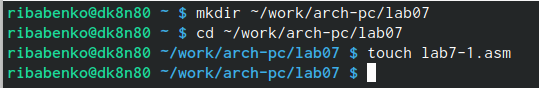{ #fig:001 width=70% }

Записываем текс программы в файл (рис. [-@fig:002])

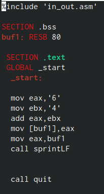{ #fig:002 width=70% }

Создаём исполняемый файл и запускаем его (рис. [-@fig:003])

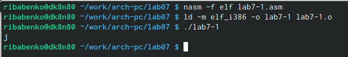{ #fig:003 width=70% }

Изменим текст программы и вместо символов, запишем в регистры числа (рис. [-@fig:004])

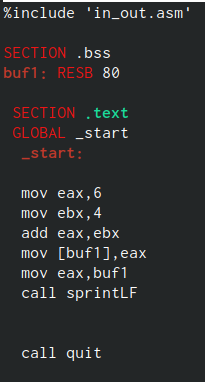{ #fig:004 width=70% }

Создаём исполняемый файл и запускаем его. Символ с номером 10 - символ перевода строки (не отображается при выводе на экран)(рис. [-@fig:005])

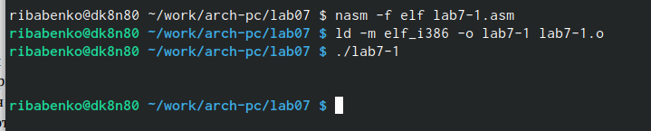{ #fig:005 width=70% }

Создаём файл 'lab7-2' (рис. [-@fig:006])

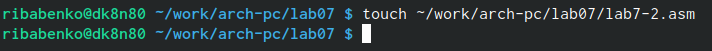{ #fig:006 width=70% }

Переписываем программу для вывода значения eax, создаём исполняемый файл и запускаем его (рис. [-@fig:007])

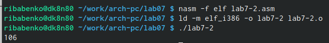{ #fig:007 width=70% }

Измениим символы на числа (рис. [-@fig:008]) и выполняем программу (рис. [-@fig:doop])

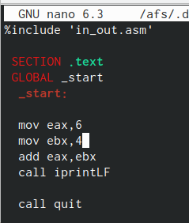{ #fig:008 width=70% }

{ #fig:doop width=70% }

Заменяем функцию iprintLF на iprint и запускаем файл (результат выводится на той же строке) (рис. [-@fig:009])

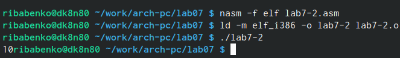{ #fig:009 width=70% }

Создаём файл 'lab7-3.asm', записываем в него предложенную программу (рис. [-@fig:010])

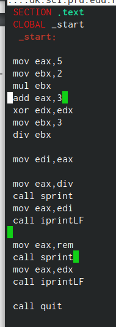{ #fig:010 width=70% }

Создаём исполняемый файл и запускаем его (рис. [-@fig:011])

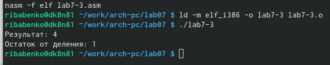{ #fig:011 width=70% }

Изменяем текст программы (изменяем выражение) и смотрим результат (рис. [-@fig:012])

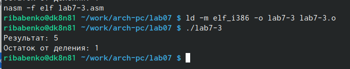{ #fig:012 width=70% }

Создаём новый файл, записываем в него программу для вычисления варианта по номеру студенческого билета  (рис. [-@fig:013])

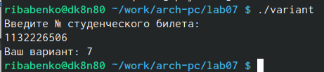{ #fig:013 width=70% }

#Ответы на вопросы

1. mov eax,rem; call sprint
   
2. Эти инструкции используются для ввода значения переменной с клавиатуры

3. Для преобразования кода ASCII в чсло

4. xor edx,edx; mov ebx,20; div ebx; inc edx

5. edx

6. Увеличивает значение на 1

7. mov eax, adx; call iprintLF

#Задание для самостоятельной работы

Напишем программу по 7 варианту, удовлетворяющую заданным условиям (рис. [-@fig:014])

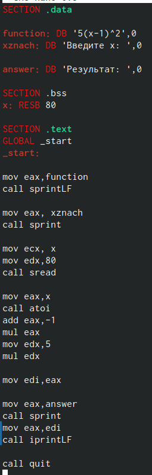{ #fig:014 width=70% }

Выполняем предложенные тесты и убеждаемся в корректности написанной программы (рис. [-@fig:015])

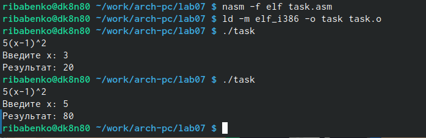{ #fig:015 width=70% }

# Выводы

В ходе выполнения лабораторной работы я освоил арифметические инструкции языка ассемблера NASM
