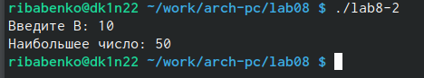

---
## Front matter
title: "Отчёт по лабораторной работе %8"
subtitle: "Дисциплина: 'архитектура компьютеров'"
author: "Бабенко Роман Игоревич"

## Generic otions
lang: ru-RU
toc-title: "Содержание"

## Bibliography
bibliography: bib/cite.bib
csl: pandoc/csl/gost-r-7-0-5-2008-numeric.csl

## Pdf output format
toc: true # Table of contents
toc-depth: 2
lof: true # List of figures
lot: true # List of tables
fontsize: 12pt
linestretch: 1.5
papersize: a4
documentclass: scrreprt
## I18n polyglossia
polyglossia-lang:
  name: russian
  options:
	- spelling=modern
	- babelshorthands=true
polyglossia-otherlangs:
  name: english
## I18n babel
babel-lang: russian
babel-otherlangs: english
## Fonts
mainfont: PT Serif
romanfont: PT Serif
sansfont: PT Sans
monofont: PT Mono
mainfontoptions: Ligatures=TeX
romanfontoptions: Ligatures=TeX
sansfontoptions: Ligatures=TeX,Scale=MatchLowercase
monofontoptions: Scale=MatchLowercase,Scale=0.9
## Biblatex
biblatex: true
biblio-style: "gost-numeric"
biblatexoptions:
  - parentracker=true
  - backend=biber
  - hyperref=auto
  - language=auto
  - autolang=other*
  - citestyle=gost-numeric
## Pandoc-crossref LaTeX customization
figureTitle: "Рис."
tableTitle: "Таблица"
listingTitle: "Листинг"
lofTitle: "Список иллюстраций"
lotTitle: "Список таблиц"
lolTitle: "Листинги"
## Misc options
indent: true
header-includes:
  - \usepackage{indentfirst}
  - \usepackage{float} # keep figures where there are in the text
  - \floatplacement{figure}{H} # keep figures where there are in the text
---

# Цель работы

Изучить команды условного и безусловного переходов, приобрести навыки написания программ с использование переходов, а также познакомиьтся с назначением и структурой файла листинга.

# Выполнение лабораторной работы

Создаём каталог lab08 и файл lab8-1.asm (рис. [-@fig:001])

{ #fig:001 width=70% }

Вводим в файл текст программы из листинга 8.1(рис. [-@fig:002])

{ #fig:002 width=70% }

Создаём исполняемый файл и запускаем его (рис. [-@fig:003])

{ #fig:003 width=70% }

Изменим программу в соответствии с листингом 8.2 и проверяем его работу(рис. [-@fig:004])

{ #fig:004 width=70% }

Снова изменяем текст программы так: (рис. [-@fig:005])

{ #fig:005 width=70% }

Проверяем нашу программу (рис. [-@fig:006])

{ #fig:006 width=70% }

Создаём файл lab8-2.asm (рис. [-@fig:007])

{ #fig:007 width=70% }

Переписываем в созданный файл программу из листинга 8.3 и провеярем его работу (рис. [-@fig:008]),(рис. [-@fig:dopl])

{ #fig:008 width=70% }

{ #fig:dopl width=70% }

Создаём файл листинга и открываем его с помощью текстового редактора (рис. [-@fig:009]) 

{ #fig:009 width=70% }

Изучаем формат и содержимое файла (рис. [-@fig:010])

{ #fig:010 width=70% }

Открываем файл с программой lab8-2.asm и на строке 39 удаляем операнд.Выполняем трансляцию с получением файла листинга  (рис. [-@fig:011])

{ #fig:011 width=70% }

Открываем текстовый редактор mcedit. (рис. [-@fig:0fa])

{ #fig:0fa width=70% }

#Задания для самостоятельной работы

Создаём файл lab8-3.asm и напишем программу для нахождения наименьшей из трёх переменных (рис. [-@fig:013])

{ #fig:013 width=70% }

Проверка написанной программы (рис. [-@fig:014])

{ #fig:014 width=70% }

Напишем программу для вычисления значения функции по 7 варианту (рис. [-@fig:015) и (рис. [-@fig:016])

{ #fig:015 width=70% }

{ #fig:016 width=70% }

Проверяем результат выполнения написанной программы (рис. [-@fig:017])

{ #fig:017 width=70% }

# Выводы

В ходе выполнения лабораторной раборы я научился пользоваться командами условного и безусловного переходов, приобрёл навыки написания программ с использование переходов, а также познакомился с назначением и структурой файла листинга.
