---
## Front matter
title: "Отчёт по лабораторной работе %9"
subtitle: "Дисциплина: 'архитектура компьютеров'"
author: "Бабенко Роман Игоревич"

## Generic otions
lang: ru-RU
toc-title: "Содержание"

## Bibliography
bibliography: bib/cite.bib
csl: pandoc/csl/gost-r-7-0-5-2008-numeric.csl

## Pdf output format
toc: true # Table of contents
toc-depth: 2
lof: true # List of figures
lot: true # List of tables
fontsize: 12pt
linestretch: 1.5
papersize: a4
documentclass: scrreprt
## I18n polyglossia
polyglossia-lang:
  name: russian
  options:
	- spelling=modern
	- babelshorthands=true
polyglossia-otherlangs:
  name: english
## I18n babel
babel-lang: russian
babel-otherlangs: english
## Fonts
mainfont: PT Serif
romanfont: PT Serif
sansfont: PT Sans
monofont: PT Mono
mainfontoptions: Ligatures=TeX
romanfontoptions: Ligatures=TeX
sansfontoptions: Ligatures=TeX,Scale=MatchLowercase
monofontoptions: Scale=MatchLowercase,Scale=0.9
## Biblatex
biblatex: true
biblio-style: "gost-numeric"
biblatexoptions:
  - parentracker=true
  - backend=biber
  - hyperref=auto
  - language=auto
  - autolang=other*
  - citestyle=gost-numeric
## Pandoc-crossref LaTeX customization
figureTitle: "Рис."
tableTitle: "Таблица"
listingTitle: "Листинг"
lofTitle: "Список иллюстраций"
lotTitle: "Список таблиц"
lolTitle: "Листинги"
## Misc options
indent: true
header-includes:
  - \usepackage{indentfirst}
  - \usepackage{float} # keep figures where there are in the text
  - \floatplacement{figure}{H} # keep figures where there are in the text
---

# Цель работы

Приобрести навыки написания программ с использованием циклов и обработкой аргументов командной строки.

# Выполнение лабораторной работы

Создаём каталог для программ лабораторной работы %9 и файл lab9-1.asm (рис. [-@fig:001])

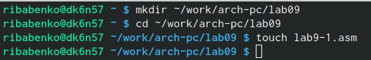{ #fig:001 width=70% }

Переписываем в файл программу из листинга 9.1 (рис. [-@fig:002])

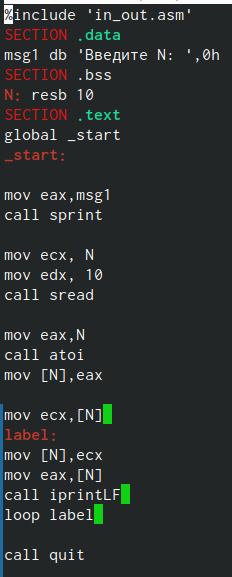{ #fig:002 width=70% }

Проверка работы файла (рис. [-@fig:003])

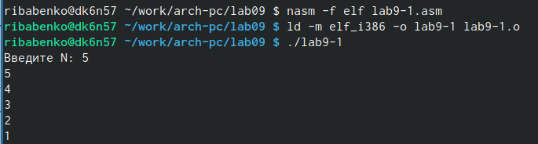{ #fig:003 width=70% }

Изменяем текст программы, и проверяем - это привело к её некорректной работе (рис. [-@fig:004])

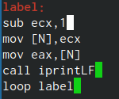{ #fig:004 width=70% }

Вносим изменения в текст программы, добавляем команды push и pop (рис. [-@fig:005])

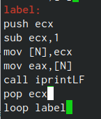{ #fig:005 width=70% }

Создаём исполняемый файл и проверяем его работу. Число проходов цикла соответствует N (рис. [-@fig:006])

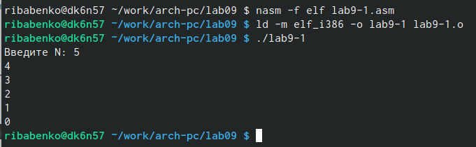{ #fig:006 width=70% }

Создаём новый файл, записываем в него текст из листинга 9.2 и запускаем его, указав предложенные аргументы. Программой было обработаено четыре аргумента (рис. [-@fig:007])

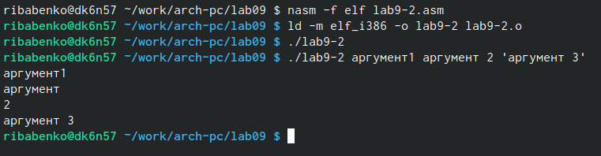{ #fig:007 width=70% }

Также создаём файл lab9-3 и переписываем в него прогнраму из листинга 9.3, проверяем работу файла (рис. [-@fig:008])

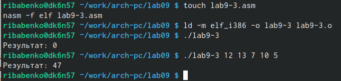{ #fig:008 width=70% }

Далее изменяем программу так, чтобы она вычисляла произведение аргументов командной строки (рис. [-@fig:009])

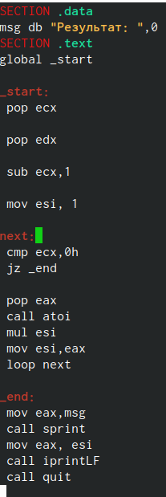{ #fig:009 width=70% }

Проверяем работоспособность изменённой программы (рис. [-@fig:010])

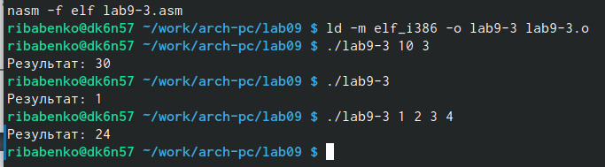{ #fig:010 width=70% }

#Задания для самостоятельной работы

Напишем программу, находящую сумму значений функции про седьмому варианту. (рис. [-@fig:011])

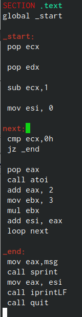{ #fig:011 width=70% }

Проверка написанной нами программы (рис. [-@fig:012])

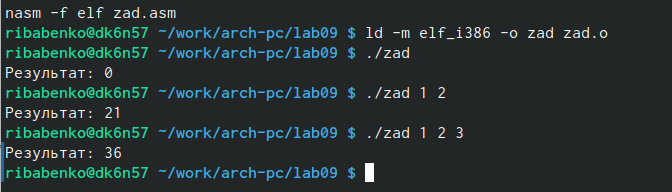{ #fig:012 width=70% }

# Выводы

В ходе выполнения данно лоборатторной работы я приобрёл навыки написанич программ с использованием циклов и обработки аргументов командной строки.
