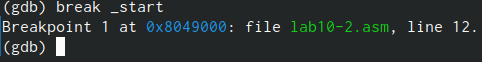

---
## Front matter
title: "Отчёт по лабораторной работе №10"
subtitle: "Дисциплина: 'архитектура компьютеров'"
author: "Бабенко Роман Игоревич"

## Generic otions
lang: ru-RU
toc-title: "Содержание"

## Bibliography
bibliography: bib/cite.bib
csl: pandoc/csl/gost-r-7-0-5-2008-numeric.csl

## Pdf output format
toc: true # Table of contents
toc-depth: 2
lof: true # List of figures
lot: true # List of tables
fontsize: 12pt
linestretch: 1.5
papersize: a4
documentclass: scrreprt
## I18n polyglossia
polyglossia-lang:
  name: russian
  options:
	- spelling=modern
	- babelshorthands=true
polyglossia-otherlangs:
  name: english
## I18n babel
babel-lang: russian
babel-otherlangs: english
## Fonts
mainfont: PT Serif
romanfont: PT Serif
sansfont: PT Sans
monofont: PT Mono
mainfontoptions: Ligatures=TeX
romanfontoptions: Ligatures=TeX
sansfontoptions: Ligatures=TeX,Scale=MatchLowercase
monofontoptions: Scale=MatchLowercase,Scale=0.9
## Biblatex
biblatex: true
biblio-style: "gost-numeric"
biblatexoptions:
  - parentracker=true
  - backend=biber
  - hyperref=auto
  - language=auto
  - autolang=other*
  - citestyle=gost-numeric
## Pandoc-crossref LaTeX customization
figureTitle: "Рис."
tableTitle: "Таблица"
listingTitle: "Листинг"
lofTitle: "Список иллюстраций"
lotTitle: "Список таблиц"
lolTitle: "Листинги"
## Misc options
indent: true
header-includes:
  - \usepackage{indentfirst}
  - \usepackage{float} # keep figures where there are in the text
  - \floatplacement{figure}{H} # keep figures where there are in the text
---

# Цель работы

Приобрести навыки программирования с использованием подпрограмм и познакомиться с методом отладки 'GDB'

# Выполнение лабораторной работы

Создаём каталог для выполнения лабораторной работы, переходим в него и создаём файл lab10-1.asm (рис. [-@fig:001])

{ #fig:001 width=70% }

Вводим в файл программу из листинга, создаем исполняемый файл и проверяем его работу (рис. [-@fig:002]) и (рис. [-@fig:003])

{ #fig:002 width=70% }

{ #fig:003 width=70% }

Добавляем подпрограмму '_subcalcul'(рис. [-@fig:004])

{ #fig:004 width=70% }

Проверяем изменённую программу (рис. [-@fig:005])

{ #fig:005 width=70% }

Создаём файл lab10-2.asm и записываем в ного програму из листинга 10.2 (рис. [-@fig:006])

{ #fig:006 width=70% }

Загружаем исполняемый файл в отладчик gdb (рис. [-@fig:007])

{ #fig:007 width=70% }

Запускаем программу с помощью команды run (рис. [-@fig:008])

{ #fig:008 width=70% }

Устанавливаем брейкпоинт на метку _start и далее запускаем её (рис. [-@fig:009])

{ #fig:009 width=70% }

Смотрим дисассимилированнйы код с помощью программы disassemble начиная с метки _start (рис. [-@fig:010])

{ #fig:010 width=70% }

Переключаемся на отображение команд с Intel’овским синтаксисом, введя
команду 'set disassembly-flavor intel'. С интеловском синтаксе, в отличие от стандартного, в третьем столбце сначала пишется название регистра(рис. [-@fig:011])

{ #fig:011 width=70% }

Включаем режим псевдографики для более удобного анализа программы (рис. [-@fig:012])

{ #fig:012 width=70% }

Проверяем наличие точки останова с помощью команды info breakpoints (рис. [-@fig:013])

{ #fig:013 width=70% }

Устанавливаем ещё одну точку установа по адресу инструкции и смотрим информауию о всех точках останова(рис. [-@fig:014])

{ #fig:014 width=70% }

Просматриваем содержимое регистров с помощью команды info registers (рис. [-@fig:015])

{ #fig:015 width=70% }

Просматриваем значение переменной msg1 по имени (рис. [-@fig:016])

{ #fig:016 width=70% }

Просматриваем значение переменной msg2 по адресу(рис. [-@fig:017])

{ #fig:017 width=70% }

Изменим первый символ переменной msg1 с помощью команды set(рис. [-@fig:018])

{ #fig:018 width=70% }

Также заменим символ в перменной msg2(рис. [-@fig:019])

{ #fig:019 width=70% }

Выведем значения регистра edx в разных форматах(рис. [-@fig:020])

{ #fig:020 width=70% }

С помощью команды set изменим значение регистра ebx. C p/s выводит значение в символьном виде(рис. [-@fig:021])

{ #fig:021 width=70% }

Завершаем выполнение программы с помощью 'countinue'(рис. [-@fig:022])

{ #fig:022 width=70% }

Копируем файл созданный при выполнении лабораторной работы номер девять и создайм исполняемый файл(рис. [-@fig:023])

{ #fig:023 width=70% }

Загружаем в gdb программу с аргументами используя ключ --args(рис. [-@fig:024])

{ #fig:024 width=70% }

Устанавливаем точку останова перед первой инструкцией и запускаем её(рис. [-@fig:025])

{ #fig:025 width=70% }

Посмотрим различные позиции стека(рис. [-@fig:026])

{ #fig:026 width=70% }

#Задания для самостоятельной работы

Напишем программу из лабораторной работы номер девять и реальзуем в ней вычисление функции через подпрограмму(рис. [-@fig:027])

{ #fig:027 width=70% }

Проверяем нашу программу(рис. [-@fig:028])

{ #fig:028 width=70% }

Испровляем программу для вычилсения умножения, поменяв регистры местами (там умножался на 4 не регистр ebx, f htubcnh eax)(рис. [-@fig:029])

{ #fig:029 width=70% }

Проверяем исправленную программу(рис. [-@fig:030])

{ #fig:030 width=70% }

# Выводы

В ходе выполнения данной лабораторной работы я приобрёл навыки программирования с использованием подпрограмм и познакомился с методом отладки 'GDB'
