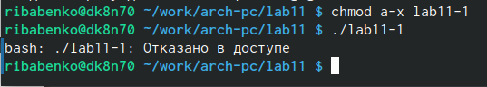

---
## Front matter
title: "Отчёт по лабораторной работе №11"
subtitle: "Дисциплина: 'архитектура компьютеров'"
author: "Бабенко Роман Игоревич"

## Generic otions
lang: ru-RU
toc-title: "Содержание"

## Bibliography
bibliography: bib/cite.bib
csl: pandoc/csl/gost-r-7-0-5-2008-numeric.csl

## Pdf output format
toc: true # Table of contents
toc-depth: 2
lof: true # List of figures
lot: true # List of tables
fontsize: 12pt
linestretch: 1.5
papersize: a4
documentclass: scrreprt
## I18n polyglossia
polyglossia-lang:
  name: russian
  options:
	- spelling=modern
	- babelshorthands=true
polyglossia-otherlangs:
  name: english
## I18n babel
babel-lang: russian
babel-otherlangs: english
## Fonts
mainfont: PT Serif
romanfont: PT Serif
sansfont: PT Sans
monofont: PT Mono
mainfontoptions: Ligatures=TeX
romanfontoptions: Ligatures=TeX
sansfontoptions: Ligatures=TeX,Scale=MatchLowercase
monofontoptions: Scale=MatchLowercase,Scale=0.9
## Biblatex
biblatex: true
biblio-style: "gost-numeric"
biblatexoptions:
  - parentracker=true
  - backend=biber
  - hyperref=auto
  - language=auto
  - autolang=other*
  - citestyle=gost-numeric
## Pandoc-crossref LaTeX customization
figureTitle: "Рис."
tableTitle: "Таблица"
listingTitle: "Листинг"
lofTitle: "Список иллюстраций"
lotTitle: "Список таблиц"
lolTitle: "Листинги"
## Misc options
indent: true
header-includes:
  - \usepackage{indentfirst}
  - \usepackage{float} # keep figures where there are in the text
  - \floatplacement{figure}{H} # keep figures where there are in the text
---

# Цель работы

Приобрести навыки написания программ для работы с файлами

# Выполнение лабораторной работы

Создаём каталог для программ лабораторной работы №11 и файлы 'lab11-1.asm', 'readme.txt' (рис. [-@fig:001])

{ #fig:001 width=70% }

Вводим в файл 'lab11-1.asm' текса из листинга 11.1, создаём исполняемый файл и проверяем его работу (рис. [-@fig:002])

{ #fig:002 width=70% }

Изменяем права доступа к исполняемому файлу (запрещаем его выполнение). При попытке выполниеть файл получаем сообщение 'Отказано в доступе' (рис. [-@fig:003])

{ #fig:003 width=70% }

Изеняем права доступа к 'lab11-1.asm', добавляя права на исполнение. (рис. [-@fig:004])

{ #fig:004 width=70% }

В соответствии с вариантом предоставляем права доступа к 'readme.asm' (рис. [-@fig:005])

{ #fig:005 width=70% }

#Задания для самостоятельной работы

Напишем программу, удовлетворяющую заданным условиям (рис. [-@fig:006]) и (рис. [-@fig:007])

{ #fig:006 width=70% }

{ #fig:007 width=70% }

Создаем исполняемый файл, выполняем программу, вводим в качестве арггумена моё имя и фамилию (рис. [-@fig:008])

{ #fig:008 width=70% }

Проверяем результат с помощью команды cat (рис. [-@fig:009])

{ #fig:009 width=70% }

# Выводы

В ходе выполнения данной лабораторной работы я приобрёл необходимые навыки и смог нарписать программу для работы с файлами
